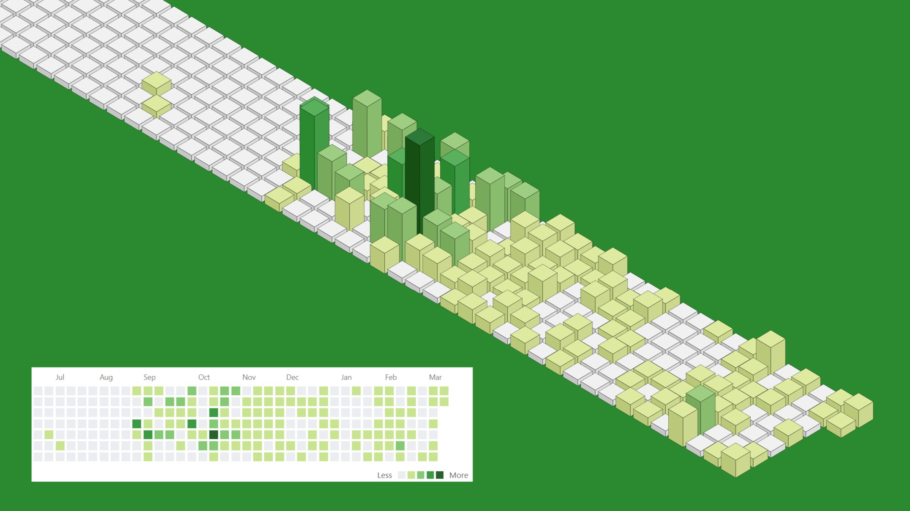

# vue-github-calendar-isometric

Demo: https://mukhin.dev

## What's it? / Что это?

EN: Github calendar in isometric on SVG and Vue.
RU: Github календарь в изометрии на SVG и Vue.

## How to use? / Как использовать?

EN:

* Rename file `.env.example` to `.env`. Add your login and token (public) from github.
* Run `npm run dev` for developer mode.
* Run `npm run build` for build web-application in directory `dist`.

RU: 

* Переименуйте файл `.env.example` в `.env`. Добавьте ваши логин и токен (публичный) от github.
* Выполните `npm run dev` для режима разработки.
* Выполните `npm run build` для построения веб-приложения в папке `dist`.
